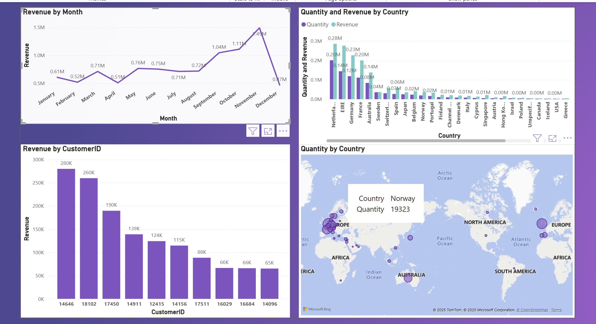

# 📊 Online Retail Sales Dashboard (Power BI)

This repository hosts the interactive **Online Retail Sales Dashboard** built using Power BI.  
The report analyzes global retail transactions and provides insights into revenue performance, customer value, and country-level purchasing behavior.

## 🚀 Key Insights

- **Revenue by Month** – tracks monthly performance and seasonal trends  
- **Quantity & Revenue by Country** – compares demand and revenue contribution across regions  
- **Global Quantity Map** – geographic distribution of order quantities using a world map visualization  
- **Revenue by CustomerID** – highlights high-value customers and purchasing concentration  

## 🖼️ Dashboard Preview

## 🗂️ File Included

- **Online Retail.pbix** – complete Power BI report containing data model, visuals, and DAX measures.

## 🛠️ Tools & Technologies

- **Power BI Desktop**  
- **Power Query** (data preparation & transformation)  
- **DAX** (calculated metrics & KPIs)  
- **Bar, Map & Line visuals** for analytical storytelling  

## 📦 How to Use

1. Download **Online Retail.pbix**  
2. Open it in **Power BI Desktop**  
3. Interact with the visuals to explore revenue, customers, and country-level patterns  
4. Connect your own dataset if adapting this for business use  

## 📈 Ideal Use Cases

- Retail & ecommerce performance monitoring  
- Customer segmentation & top-customer analysis  
- Global sales trend evaluation  
- Business intelligence portfolios  

## 🔮 Future Enhancements

- Add profit & cost analysis  
- Create RFM segmentation model for customer scoring  
- Add forecasting visuals for revenue prediction  
- Build drill-through pages for customer-level deep dives  
